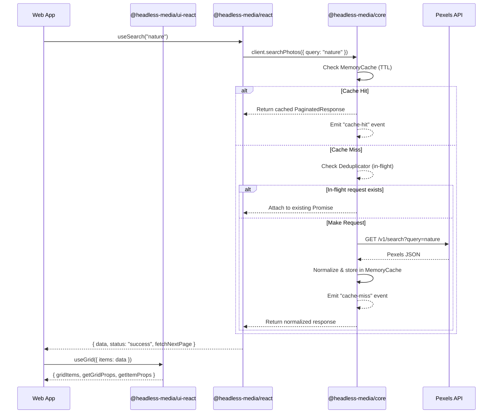

# ⚡️ Headless Media SDK Ecosystem

> A production-grade, npm-publishable, headless media SDK ecosystem for the Pexels API, built as a TurboRepo / pnpm monorepo.

[](https://headless-media-app.vercel.app/)
[](https://headless-media-sdk-doc.vercel.app/)

| Resource | Live Production Link |
| :--- | :--- |
| 🌐 **Live Web Application Demo** | [https://headless-media-app.vercel.app/](https://headless-media-app.vercel.app/) |
| 📚 **Live Documentation Site** | [https://headless-media-sdk-doc.vercel.app/](https://headless-media-sdk-doc.vercel.app/) |

---

## 🌟 Overview

The **Headless Media SDK** is an enterprise-grade TypeScript ecosystem designed to decouple media API logic (fetching, caching, deduplication, retry, event listening) from UI presentation. 

It provides:
- A **100% framework-agnostic pure TypeScript core SDK** (`@headless-media/core`) with zero external runtime dependencies.
- A **React wrapper package** (`@headless-media/react`) offering context provider and reactive hooks with infinite scroll support.
- A **Headless UI primitive package** (`@headless-media/ui-react`) exposing accessible prop-getters and zero styling opinion for building custom galleries, lightboxes, and vertical swipers.
- Stub bindings for **React Native** (`@headless-media/native` & `@headless-media/ui-native`).
- A production **Vite + React demo application** (`apps/web-app`) with Pinterest-style pin detail view, video reels, live event streaming drawer, and persistent favorites.

---

## 📦 Monorepo Package Topology

| Package | Version | Description | Target Runtime |
|---|---|---|---|
| [`@headless-media/core`](./packages/media-core) | `0.1.0` | Framework-agnostic SDK core (API, Memory Cache, Dedup, Events, Retry, Typed Errors) | Any JS (Browser, Node, Deno, Bun) |
| [`@headless-media/react`](./packages/media-react) | `0.1.0` | React bindings (`MediaProvider` & reactive query hooks) | React 18+ |
| [`@headless-media/ui-react`](./packages/media-ui-react) | `0.1.0` | Headless UI primitives (`useGrid`, `useLightbox`, `useReelSwiper`) | React 18+ |
| [`@headless-media/native`](./packages/media-native) | `0.1.0` | React Native SDK wrapper stub | React Native |
| [`@headless-media/ui-native`](./packages/media-ui-native) | `0.1.0` | Headless UI primitives for React Native stub | React Native |
| [`apps/web-app`](./apps/web-app) | `0.1.0` | Production Vite + React demo application | Browser |

---

## 🔒 Strict Architecture & Dependency Rules

The monorepo enforces strict dependency boundaries:

```text
       ┌────────────────────────┐
       │     apps/web-app       │
       └───┬────────────────┬───┘
           │                │
           ▼                ▼
┌─────────────────────┐  ┌────────────────────────┐
│ @headless-media/    │  │ @headless-media/       │
│ react               │  │ ui-react               │
└──────────┬──────────┘  └────────────────────────┘
           │               (NO SDK imports, NO API)
           ▼               (NO CSS / Pure Headless)
┌─────────────────────┐
│ @headless-media/    │
│ core                │
└─────────────────────┘
 (Pure TS / Zero Deps)
```

1. **`@headless-media/core`**: Pure TypeScript only. **NO DOM, NO React, NO React Native imports**. Zero runtime dependencies (`package.json` dependencies is empty).
2. **`@headless-media/ui-react`**: Pure Headless UI. **NO SDK imports, NO API calls, NO CSS or Tailwind**. Provides prop-getters and accessibility (ARIA) attributes only.
3. **`apps/web-app`**: The application is the **only place** that imports both `@headless-media/react` (for data) and `@headless-media/ui-react` (for presentation) and composes them together.

---

## 🏗️ Core Architecture & Features

### 1. In-Memory TTL Cache & Lazy Eviction (`MemoryCache`)
- O(1) `Map`-based storage.
- Configurable TTL (time-to-live) and maximum entry capacity (`maxEntries`).
- FIFO eviction strategy when capacity limit is reached.
- **Lazy evaluation on read**: Eviction occurs when items are accessed, avoiding background timer handles that prevent Node.js process cleanup.

### 2. Request Deduplication (`Deduplicator`)
- Automatically deduplicates concurrent in-flight requests with identical query signatures.
- Caches the pending `Promise` instance so secondary callers receive the exact same network request result.

### 3. Observer Event Emitter (`MediaEventEmitter`)
- Subscribes to SDK events: `search`, `view`, `download`, `cache-hit`, `cache-miss`, and `error`.
- Error isolation: exceptions thrown inside subscriber callbacks are caught and logged without breaking other handlers or SDK execution.

### 4. Exponential Backoff Retry Logic (`withRetry`)
- Retries failed network requests and HTTP `5xx` / `429` status codes.
- Formula: `min(baseDelay * 2^attempt, maxDelay) + jitter`.
- Never retries client non-retryable errors (`401`, `404`).

### 5. Branded Nominal Types (`ApiKey`, `PhotoId`, `VideoId`)
- Nominal type tagging prevents passing arbitrary strings or cross-mixing photo and video IDs at compile time.
- Validated via factory functions (`createApiKey`, `createPhotoId`, `createVideoId`).

---

## 📊 Data Flow Sequence



---

## 🚀 Quick Start Guide

### Prerequisites
- **Node.js**: v18.0.0+
- **pnpm**: v8.0.0+

### 1. Installation & Monorepo Setup

```bash
# Install all workspace dependencies
pnpm install
```

### 2. Build All Packages

```bash
# Build all packages via TurboRepo
pnpm build
```

### 3. Run Automated Unit Tests

```bash
# Run Vitest test suites across core and UI packages
pnpm test
```

### 4. Launch Web Application Demo

```bash
# Start Vite development server
pnpm dev
```

Open [http://localhost:3000](http://localhost:3000) in your browser.

---

## 💡 Code Usage Example

```tsx
import React from 'react';
import { MediaProvider, createApiKey, useSearch } from '@headless-media/react';
import { useGrid, useLightbox } from '@headless-media/ui-react';

const sdkConfig = {
  apiKey: createApiKey('YOUR_PEXELS_API_KEY'),
  cache: { ttl: 300000, maxEntries: 100 },
  retry: { maxRetries: 3, baseDelay: 1000 },
};

export function App() {
  return (
    <MediaProvider config={sdkConfig}>
      <PhotoGallery />
    </MediaProvider>
  );
}

function PhotoGallery() {
  const { data: photos, status, fetchNextPage } = useSearch('nature');

  const lightbox = useLightbox({
    items: photos.map((p) => ({ src: p.src.large, alt: p.alt })),
    loop: true,
  });

  const { gridItems, getGridProps, getItemProps } = useGrid({
    items: photos,
    columns: 4,
    getItemKey: (p) => p.id,
    onItemClick: (_, index) => lightbox.open(index),
  });

  if (status === 'loading') return <div>Loading photos...</div>;

  return (
    <div {...getGridProps({ className: 'my-gallery-grid' })}>
      {gridItems.map((gi) => (
        <div {...getItemProps(gi, { className: 'gallery-item' })} key={gi.key}>
          
        </div>
      ))}
    </div>
  );
}
```

---

## 📖 Public API Reference

### 1. `@headless-media/core`

```ts
import { createMediaClient, createApiKey } from '@headless-media/core';

const client = createMediaClient({ apiKey: createApiKey('key') });
```

#### Core Client Methods

| Method | Parameters | Return Type | Description |
|---|---|---|---|
| `searchPhotos(params)` | `PhotoSearchParams` | `Promise<PaginatedResponse<PexelsPhoto>>` | Search photos with optional query, orientation, size, color |
| `getCurated(params?)` | `CuratedParams` | `Promise<PaginatedResponse<PexelsPhoto>>` | Retrieve curated/trending photos feed |
| `getPhotoById(id)` | `PhotoId` | `Promise<PexelsPhoto>` | Fetch single photo details by ID |
| `searchVideos(params)` | `VideoSearchParams` | `Promise<PaginatedResponse<PexelsVideo>>` | Search video reels with orientation filters |
| `getPopularVideos(params?)` | `PopularVideoParams` | `Promise<PaginatedResponse<PexelsVideo>>` | Retrieve popular video reels |
| `getVideoById(id)` | `VideoId` | `Promise<PexelsVideo>` | Fetch single video details by ID |
| `download(url)` | `string` | `Promise<void>` | Track media download event for analytics |
| `subscribe(event, handler)` | `MediaEventType`, `Handler` | `Unsubscribe` | Subscribe to SDK event emissions |
| `destroy()` | `void` | `void` | Abort in-flight requests, clear cache & unsubscribe listeners |

---

### 2. `@headless-media/react`

#### Components & Hooks

| Export | Type | Description |
|---|---|---|
| `<MediaProvider config={...}>` | Component | Context provider that initializes and manages `MediaClient` lifecycle |
| `useMedia()` | Hook | Access current `MediaClient` instance from React context |
| `useSearch(query, options)` | Hook | Reactive photo search hook supporting auto-fetch & infinite scroll (`fetchNextPage`) |
| `useCurated(options)` | Hook | Reactive curated feed hook with pagination & `refetch()` method |
| `useDownload()` | Hook | Wrapper hook around `client.download()` with loading & error state |
| `useMediaEvents(type, handler)` | Hook | Auto-subscribing event listener hook with stable reference handling |

---

### 3. `@headless-media/ui-react`

#### Headless UI Hooks

| Hook | Return Value | Features & ARIA Attributes |
|---|---|---|
| `useGrid(options)` | `{ gridItems, getGridProps, getItemProps }` | Responsive column grid, `role="list"`, `role="listitem"`, Keyboard activation (Enter/Space) |
| `useLightbox(options)` | `{ isOpen, currentIndex, currentItem, open, close, next, prev, getBackdropProps, getContentProps, getImageProps, getCloseButtonProps, getNextButtonProps, getPrevButtonProps }` | Focus trap (`useFocusTrap`), body scroll locking, Keyboard navigation (Esc, Left/Right arrows), `role="dialog"`, `aria-modal` |
| `useReelSwiper(options)` | `{ activeIndex, activeItem, getContainerProps, getSlideProps, scrollTo }` | `IntersectionObserver` active detection, vertical snap scrolling, Keyboard navigation (Up/Down arrows), `role="feed"`, `role="article"` |

---

## 💻 Pushing Code to GitHub

If you are setting up this repository on GitHub for the first time, run the following commands in your terminal:

```bash
# 1. Stage all project files (sensitive .env.local is automatically ignored)
git add .

# 2. Commit files
git commit -m "feat: complete Headless Media SDK monorepo with web app and headless UI primitives"

# 3. Ensure branch name is main
git branch -M main

# 4. Push to remote repository
git push -u origin main
```

---

## 🌐 Deploying to Vercel

This repository is pre-configured for 1-click deployment on Vercel via [`vercel.json`](file:///c:/Headless%20Media%20SDK/vercel.json).

### Option 1: Vercel Dashboard (Recommended)

1. Go to [Vercel Dashboard](https://vercel.com/new) and import your GitHub repository (`Sangram10c/Headless-Media-SDK`).
2. Vercel will automatically detect the settings from `vercel.json`:
   - **Framework Preset**: `Vite`
   - **Build Command**: `pnpm build`
   - **Output Directory**: `apps/web-app/dist`
3. Under **Environment Variables**, add:
   - `VITE_PEXELS_API_KEY`: Your Pexels API Key
4. Click **Deploy**! 🚀

---

### Option 2: Vercel CLI

```bash
# Install Vercel CLI globally
npm i -g vercel

# Deploy project
vercel
```

---

## 📚 Additional Documentation

- 📐 [Architecture Specification](./docs/Architecture.md)
- 📝 [Public API Reference](./docs/API.md)
- 🗺️ [Workspace Directory Map](./docs/FolderStructure.md)
- 📜 [Architectural Decision Log (ADRs)](./docs/DecisionLog.md)
- 🤖 [AI Agent Skill: Data Wiring](./docs/skills/media-react-wiring.md)
- 🤖 [AI Agent Skill: Headless UI Components](./docs/skills/media-ui-react-components.md)
- 🤝 [Contributing Guidelines](./docs/Contributing.md)
- 📋 [Changelog](./docs/Changelog.md)

---

## 📄 License

MIT © [Sangram](https://github.com/Sangram10c)
