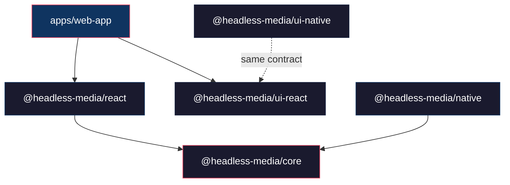
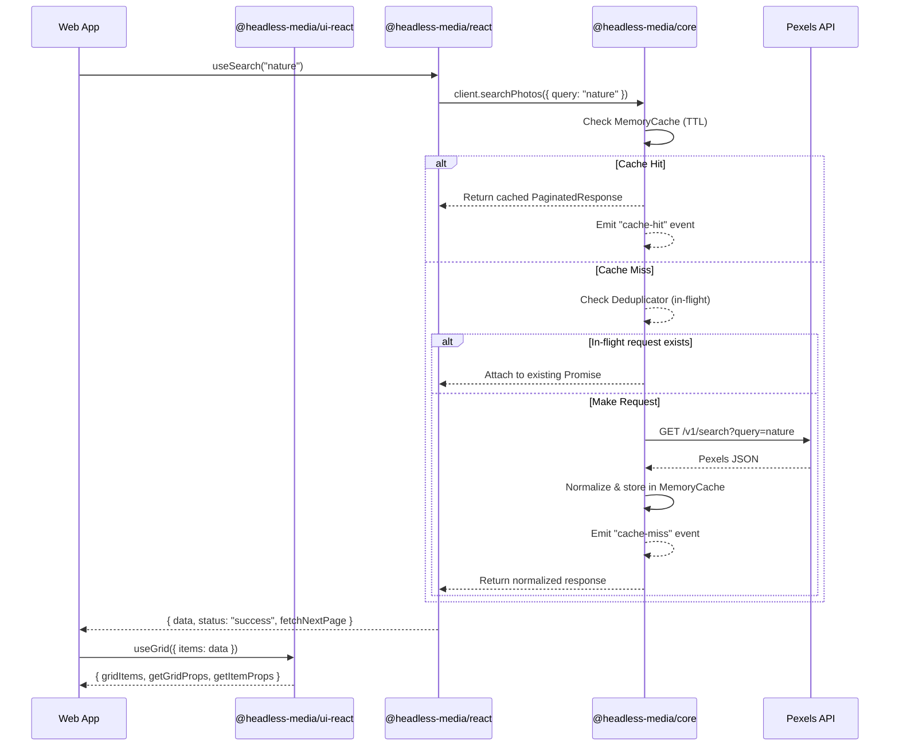

# Architecture Specification — Headless Media SDK

## Executive Summary

The Headless Media SDK ecosystem is designed as an open-source, multi-package monorepo managed with **TurboRepo** and **pnpm**. It provides a framework-agnostic core (`@headless-media/core`), React bindings (`@headless-media/react`), React Native bindings (`@headless-media/native`), and headless UI primitive component libraries (`@headless-media/ui-react`, `@headless-media/ui-native`).

---

## Dependency Topology & Boundaries

### Strict Architectural Boundaries

- **`@headless-media/core`**: 100% Pure TypeScript. NO DOM, NO React, NO React Native imports.
- **`@headless-media/ui-react`**: Pure Headless UI. NO API calls, NO SDK imports (`@headless-media/core`), NO CSS/Tailwind. Behavior & accessibility only.
- **`apps/web-app`**: The application is the ONLY place that imports both `@headless-media/react` (for data/events) and `@headless-media/ui-react` (for presentation) and composes them together.

---

## Data Flow Sequence

---

## Core Design Patterns

1. **Observer Pattern**: `MediaEventEmitter` allows subscribers to listen to SDK activity (`search`, `view`, `download`, `cache-hit`, `cache-miss`, `error`).
2. **Prop-Getters Pattern**: Headless UI packages expose functions (`getGridProps`, `getItemProps`, `getBackdropProps`) that return merged DOM props and ARIA attributes without imposing visual styles.
3. **Linked AbortController**: Per-request cancellation linked to global SDK cleanup signal for memory-leak prevention.
4. **Branded Types**: Nominal type system (`ApiKey`, `PhotoId`, `VideoId`) preventing structural interchange errors.
