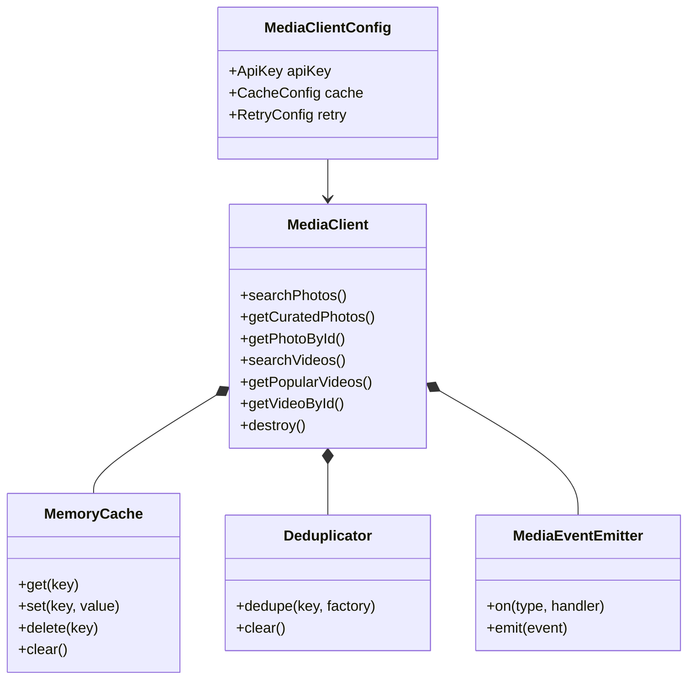

# Architecture & System Design

The **Headless Media SDK** is engineered around the **Headless UI / Engine** pattern. The core execution engine is decoupled from React rendering, allowing shared caching, deduplication, telemetry, and retry mechanics across Web and Mobile.

---

## Architectural Principles

1. **Strict Separation of Concerns**: `@headless-media/core` has zero React or DOM dependencies.
2. **Nominal Type Safety**: Critical strings (API keys, Photo IDs, Video IDs) are branded types (`ApiKey`, `PhotoId`, `VideoId`) preventing string swapping bugs.
3. **Layered Cache & Deduplication**: Outgoing HTTP requests pass through an in-memory LRU cache (`MemoryCache`) and in-flight request deduplicator (`Deduplicator`).
4. **Resilience Engineering**: All network requests pass through `withRetry` implementing exponential backoff with full randomized jitter.
5. **Telemetry & Event Bus**: Every action emits structured events (`search`, `view`, `download`, `cache-hit`, `cache-miss`, `error`).

---

## High-Level Component Architecture Diagram

```mermaid
graph TD
    App[Consumer App / web-app] --> UIReact[@headless-media/ui-react]
    App --> ReactPkg[@headless-media/react]
    
    ReactNativeApp[Mobile App] --> UINative[@headless-media/ui-native]
    ReactNativeApp --> NativePkg[@headless-media/native]
    
    ReactPkg --> Core[@headless-media/core]
    NativePkg --> Core
    UIReact --> Core
    UINative --> Core
    
    subgraph Core SDK Infrastructure
        Core --> MediaClient[MediaClient]
        MediaClient --> Cache[MemoryCache LRU]
        MediaClient --> Dedup[Request Deduplicator]
        MediaClient --> Retry[Exponential Backoff + Jitter]
        MediaClient --> Bus[MediaEventEmitter]
    end
    
    MediaClient --> PexelsAPI[Pexels REST API]
```

---

## Layered Package Breakdown

```
+-----------------------------------------------------------------------+
|                       web-app / Consumer Application                  |
+-----------------------------------------------------------------------+
|  @headless-media/ui-react           |  @headless-media/ui-native     |
|  (useGrid, useLightbox, useReel)    |  (Native prop getters)         |
+-------------------------------------+---------------------------------+
|  @headless-media/react              |  @headless-media/native        |
|  (MediaProvider, useSearch, etc.)   |  (RN MediaProvider & hooks)    |
+-----------------------------------------------------------------------+
|                    @headless-media/core                               |
|  (MediaClient, MemoryCache, Deduplicator, withRetry, EventEmitter)    |
+-----------------------------------------------------------------------+
|                    Pexels API (https://api.pexels.com/v1)              |
+-----------------------------------------------------------------------+
```

---

## Dependency Graph


